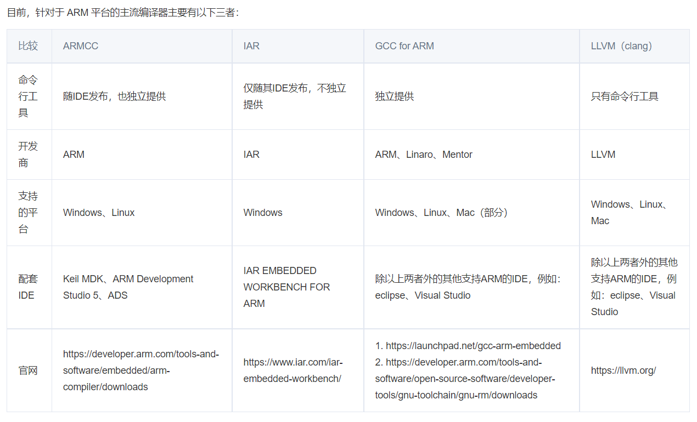

# 一、编译

## 1.1 使用MDK编译

### 1.1.1 ARMCC

### 1.1.2 ARMCLANG

## 1.2 使用EW编译

## 1.3 使用gcc编译

## 1.4 编译RTOS工程

# 二、下载

## 2.1 串口下载

## 2.2 Jlink下载

## 2.3 下载到指定内存空间

# 三、启动

## 3.1 裸机启动

### 3.1.1 汇编启动文件

## 3.2 RTOS启动

# 四、调试

## 4.1 软件调试

## 4.2 硬件调试

### 4.2.1 MDK调试

### 4.2.2 Ozone调试

